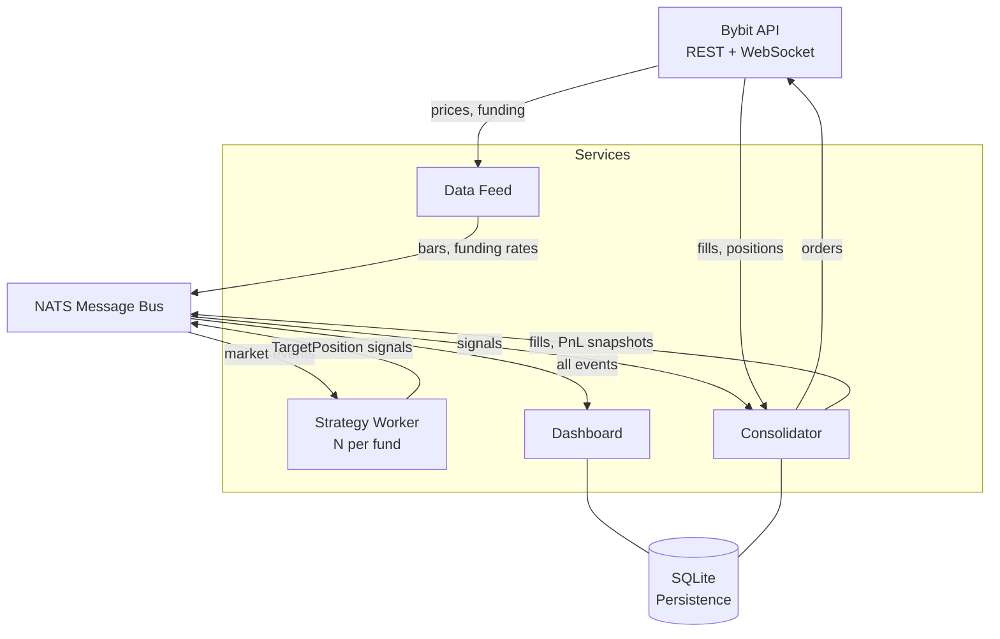

# Architecture

The infrastructure is a set of independent services communicating exclusively through a message bus. No service holds a direct reference to any other. This design allows components to be restarted, upgraded, or replaced without coordinated downtime.

## System Diagram

## Layers

### 1 · Market Data

The **Data Feed** connects to Bybit's WebSocket API and publishes normalised market events onto the bus.

| Attribute | Detail |
|---|---|
| Source | Bybit WebSocket (klines, tickers, funding rates) |
| Normalisation | `TimeBar`, `FundingRate`, `Trade` in internal format |
| Bar aggregation | 1-hour klines composed into 8-hour bars at settlement boundaries (`00:00`, `08:00`, `16:00` UTC) |
| Reconnect | Automatic on disconnect, exponential backoff |
| Published topics | `futures.{SYMBOL}.bars.{interval}`, `futures.{SYMBOL}.funding_rate` |

The same connectors serve historical backfills, so research and live trading share identical data types.

### 2 · Strategy

Each **Strategy Worker** hosts one strategy instance. The strategy subscribes to market events, evaluates its logic, and emits a `TargetPosition` when it wants to trade.

| Attribute | Detail |
|---|---|
| Interface | `BaseStrategy` — `on_bar`, `on_funding_rate`, `on_fill`, `on_start`, `on_stop` |
| Signal type | `TargetPosition` — signed quantity delta (positive = buy, negative = sell) |
| State reconciliation | On startup, `restore_from_positions()` rebuilds internal state from broker positions |
| Heartbeat | State snapshot published to `heartbeat.{strategy_id}` every 8 seconds |
| Isolation | One OS process per strategy — no shared memory |

Strategies have no knowledge of exchanges, order routing, or execution. They emit intents.

### 3 · Order Management

The **Consolidator** is the fund's Order Management System. It is the only service that submits orders to the exchange.

| Attribute | Detail |
|---|---|
| Input | `TargetPosition` signals from all strategy workers |
| Netting | Positions summed across strategies per `(symbol, exchange)` before order submission |
| Lot precision | Enforced per instrument (e.g. `ETHUSDT` perp = `0.01`, `LINKUSDT` spot = `0.001`) |
| Minimum order | Sub-threshold deltas are silently dropped rather than placed |
| Reconciliation | `seed_from_broker()` on startup — internal state matches live broker positions |
| Publishing cadence | `positions.snapshot` and `broker.pnl` every 1 second |

Netting example — when Strategy A wants `+3 ETHUSDT` and Strategy B wants `−1 ETHUSDT`, the consolidator submits a single order for `+2 ETHUSDT` rather than two separate orders.

### 4 · Execution

Brokers are exchange adapters implementing a single interface (`BaseBroker`). Adding a new venue is isolated to a single file.

| Broker | Implements | Products |
|---|---|---|
| `BybitBroker` | `BaseBroker` | Bybit perpetual futures |
| `BybitSpotBroker` | `BaseBroker` | Bybit spot |
| `PaperBroker` | `BaseBroker` | Simulated fills for testing |
| `LighterBroker` | `BaseBroker` | Lighter perpetual futures (integrated, not currently deployed) |

Every broker exposes identical methods: `place_order`, `cancel_order`, `open_orders`, `position`, `aclose`. Symbol naming is unified — each broker translates internally to its native format.

### 5 · Risk

Risk is enforced at four layers, from tightest to loosest scope.

| Layer | Control | Enforced By |
|---|---|---|
| Signal | Strategy-internal filters (volatility, regime, threshold) | Strategy code |
| Position | Maximum allocation per instrument | Strategy sizing logic |
| Strategy | `StrategyGuard` — halts on cumulative loss exceeding `max_loss` | Runner |
| Fund | Structural: delta-neutrality of the deployed strategy eliminates directional exposure | Strategy construction |

A `StrategyGuard` breach stops signal generation and requires operator intervention to reset. It does not automatically flatten positions — a paused strategy holds its book until an operator decides otherwise.

### 6 · Monitoring

The **Dashboard Backend** subscribes to every relevant topic and persists all events to SQLite at `~/.qrf/dashboard.db`.

| Data | Retention |
|---|---|
| Broker PnL snapshots | 1,000 most recent |
| Per-strategy PnL snapshots | 1,000 most recent per strategy |
| Orders | 500 most recent |
| Fills | 500 most recent per strategy |

The **React Frontend** connects via REST for historical data and WebSocket for live updates. All metrics displayed (Sharpe, drawdown, win rate) are computed from the same event stream that drives the trading system — there is no separate reporting pipeline.

## Topic Map

| Topic | Publisher | Subscribers |
|---|---|---|
| `futures.{SYMBOL}.bars.{interval}` | Data Feed | Strategy Worker, Dashboard |
| `futures.{SYMBOL}.funding_rate` | Data Feed | Strategy Worker, Dashboard |
| `signals.targets.{strategy_id}` | Strategy Worker | Consolidator |
| `fills.{strategy_id}` | Consolidator | Strategy Worker |
| `broker.pnl` | Consolidator | Strategy Worker, Dashboard |
| `broker.pnl.{exchange}` | Consolidator | Dashboard |
| `positions.snapshot` | Consolidator | Dashboard |
| `heartbeat.{strategy_id}` | Strategy Worker | Dashboard |

## Persistence

Two SQLite databases are maintained on the host:

| Path | Owner | Content |
|---|---|---|
| `~/.qrf/dashboard.db` | Dashboard Backend | Historical PnL, orders, fills, positions |
| `~/.qrf/consolidator.db` | Consolidator | Realised-PnL baseline for atomic delta-neutral accounting |

Both databases are byproducts of the event stream — nothing in either is required for correctness. If both are deleted, the system reseeds from broker truth on restart and rebuilds history from the next tick forward.
