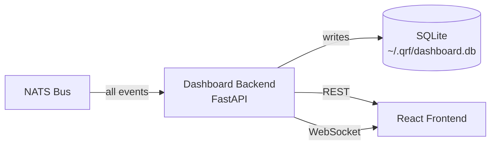

# Dashboard

The Dashboard is the operator's view of the fund. It provides real-time visibility into positions, P&L, orders, fills, and risk metrics, and persists a complete audit trail from system inception.

**Backend** — `workers.dashboard` (FastAPI · Uvicorn)  
**Frontend** — `dashboard/frontend` (React · Vite)  
**Live deployment** — [qrfzurich.com](https://qrfzurich.com)

## Architecture



The backend subscribes to every relevant NATS topic and writes incoming data to SQLite. All API responses are served from this store, so the dashboard reflects the same event history that drives the trading system — no separate reporting pipeline exists.

## REST API

| Endpoint | Description |
|---|---|
| `GET /pnl` | Latest P&L snapshot per strategy |
| `GET /pnl/{strategy_id}` | Full P&L history for a strategy |
| `GET /aggregate` | Cross-strategy P&L bucketed to 30-second intervals |
| `GET /broker` | Broker-level equity, wallet balance, P&L |
| `GET /fund` | Fund-level AUM, total P&L, available balance |
| `GET /metrics` | Sharpe ratio, max drawdown, win rate, total return |
| `GET /positions` | Current open positions across all venues |
| `GET /orders` | Last 500 orders across all strategies |
| `GET /fills/{strategy_id}` | Last 500 fills for a strategy |
| `GET /funding-vs-fees` | Funding earned versus fees paid over the last 30 days |
| `GET /bars/{symbol}/{interval}` | Historical price bars |
| `GET /symbols` | Discovered symbol × interval pairs from the event stream |

Interactive documentation at `http://localhost:8000/docs`.

## Metrics

All metrics are computed on the 8-hour settlement grid — the natural sampling frequency of the strategy.

| Metric | Definition |
|---|---|
| Total return | Cumulative P&L divided by starting AUM |
| Sharpe ratio | Annualised risk-adjusted return using `1095` periods per year (365 × 3), population standard deviation |
| Max drawdown | Absolute and percentage terms, peak-to-trough over the full history |
| Win rate | Fraction of 8-hour periods with positive return |

Metrics require a minimum of `60` snapshots and `1` hour of history before they are computed.

## Retention

| Data | Retention |
|---|---|
| Broker P&L snapshots | 1,000 most recent |
| Per-strategy P&L snapshots | 1,000 most recent per strategy |
| Orders | 500 most recent |
| Fills | 500 most recent per strategy |

Retention limits apply to the in-memory serving layer. The underlying SQLite store retains everything indefinitely.

## Startup Behaviour

On startup, the backend seeds its in-memory stores from SQLite. This means the UI immediately displays historical data without waiting for a live event to arrive — a fresh dashboard load looks identical to one that has been running for weeks.

## Configuration

| Variable | Default | Description |
|---|---|---|
| `NATS_URL` | `nats://localhost:4222` | NATS connection string |

## Operation

Backend:

```bash
uvicorn workers.dashboard:app --port 8000
```

Frontend (development):

```bash
cd dashboard/frontend
npm run dev
```

Frontend (production build):

```bash
cd dashboard/frontend
npm run build
```
