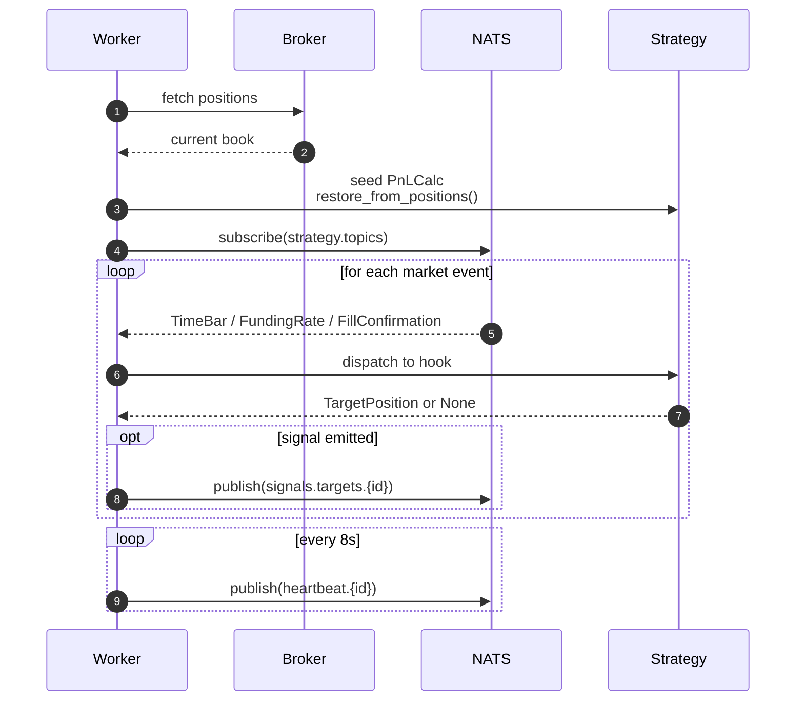

# Strategy Worker

A Strategy Worker hosts a single strategy instance and manages its full lifecycle — from startup reconciliation, through event dispatch, to signal publishing and heartbeat emission.

**Module** — `workers.strategy_worker`

## Responsibilities

- Load the strategy class named by `STRATEGY_NAME` from the `strategies` package
- Reconcile internal state against live broker positions on startup
- Subscribe to the NATS topics declared in `strategy.topics`
- Dispatch market events to strategy hooks (`on_bar`, `on_funding_rate`, `on_fill`)
- Publish `TargetPosition` signals to the consolidator
- Publish state heartbeats to the dashboard
- Enforce the `StrategyGuard` loss threshold

## Lifecycle



On startup, the worker never assumes its own prior state is correct. It queries the broker, seeds the internal PnL calculator with existing positions, and only then begins consuming events.

## Consumed Topics

| Topic | Type | Handler |
|---|---|---|
| `futures.{SYMBOL}.bars.{interval}` | `TimeBar` | `strategy.on_bar()` |
| `futures.{SYMBOL}.funding_rate` | `FundingRate` | `strategy.on_funding_rate()` |
| `fills.{strategy_id}` | `FillConfirmation` | `strategy.on_fill()` |
| `broker.pnl` | PnL delta | `StrategyGuard.record_pnl()` |

## Published Topics

| Topic | Type | Cadence |
|---|---|---|
| `signals.targets.{strategy_id}` | `TargetPosition` | Whenever a hook returns a non-`None` signal |
| `heartbeat.{strategy_id}` | State snapshot | Every 8 seconds |

## Heartbeat Payload

Each heartbeat carries the strategy's live state:

- `fill_state` — per symbol: `flat`, `entering`, `hedged`, `exiting`
- `perp_qty`, `spot_qty` — current position sizes
- `entry_price` — average entry price for the current position
- `holding_periods` — number of settlement periods since entry
- `cum_funding` — cumulative funding collected while position was held
- `last_settled_window` — timestamp of the most recent decision window

The dashboard consumes these heartbeats to render real-time strategy state without querying the worker directly.

## Risk Guard

Each worker holds a `StrategyGuard` initialised with the strategy's `max_loss` threshold. The guard consumes `broker.pnl` and accumulates cumulative realised P&L.

When cumulative loss exceeds `max_loss`, the guard becomes inactive and the worker stops emitting signals. Existing positions are held until an operator intervenes.

## Configuration

| Variable | Default | Description |
|---|---|---|
| `STRATEGY_NAME` | *(required)* | Class name of a `BaseStrategy` subclass in `strategies/` |
| `NATS_URL` | `nats://localhost:4222` | NATS connection string |
| `BYBIT_API_KEY` | *(required)* | Bybit API key |
| `BYBIT_API_SECRET` | *(required)* | Bybit API secret |
| `BYBIT_DEMO` | `0` | Set to `1` for the Bybit demo environment |

## Operation

```bash
STRATEGY_NAME=FundingArbBybitStrategy python -m workers.strategy_worker
```

Spawn one worker per strategy. Each process is fully isolated — restarting one has no effect on any other.
