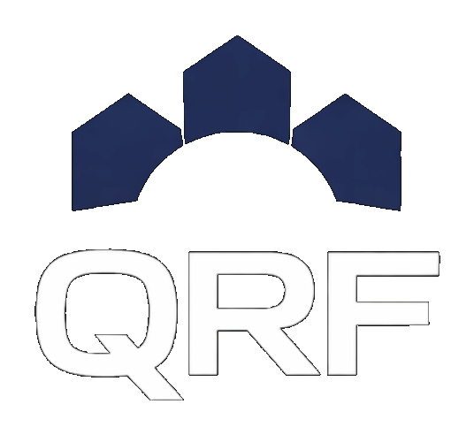
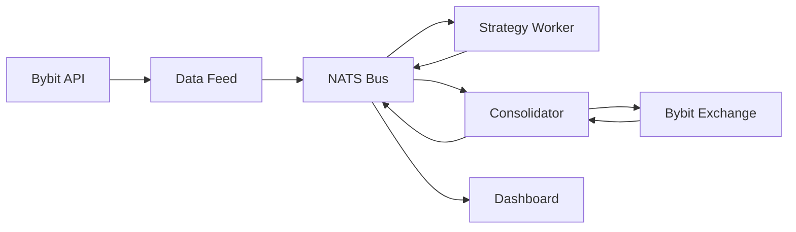

---
hide:
  - navigation
  - toc
---

Quantitative Research Fund · ETH Zurich

<h1 class="hero__title">Systematic Trading Infrastructure</h1>

Production infrastructure for the full lifecycle of a systematic strategy — market data ingestion, signal generation, order management, execution, and performance attribution. Strategy-agnostic by design.

[Getting Started](getting-started.md){ .hero__button .hero__button--primary }
[Architecture](architecture.md){ .hero__button .hero__button--secondary }

## Overview

QRF operates a fully automated systematic trading pipeline running live on Bybit. Every layer of the stack — from data feeds to execution — is proprietary, and every strategy plugs into the same infrastructure without modification.

Venue

Bybit

Products

Perp · Spot

Strategies

1 Live

AUM

$30,000

## Pipeline

Each stage is an independent process communicating over a message bus. Components can be restarted, upgraded, or scaled without coordinated downtime.

## Documentation

-   ### Getting Started

    Install dependencies, configure credentials, and bring the full pipeline online.

    [Read the guide →](getting-started.md)

-   ### Architecture

    Layer-by-layer breakdown of the pipeline — data, strategy, order management, execution, risk, monitoring.

    [View architecture →](architecture.md)

-   ### Writing a Strategy

    The strategy interface, event hooks, signal semantics, and a minimal working example.

    [Learn the interface →](strategies/writing-a-strategy.md)

-   ### Components

    Deep dives into each service — data feed, strategy worker, consolidator, dashboard.

    [Browse components →](components/data-feed.md)

-   ### API Reference

    Auto-generated interface documentation for `BaseStrategy`, `BaseBroker`, and core execution types.

    [Read the reference →](api/strategy.md)

-   ### Live Dashboard

    Real-time P&L, positions, orders, and risk metrics from the live deployment.

    [Open dashboard →](https://qrfzurich.com)

## Design Principles

-   ### Strategy-agnostic

    Infrastructure is the product. Strategies implement a single interface and plug into an otherwise unchanged pipeline.

-   ### Broker truth is authoritative

    On restart, every component reconciles internal state against live broker positions. Local state is never assumed authoritative.

-   ### Netted execution

    A central Order Management System nets positions across strategies before submitting orders. Two strategies with opposing views produce one net order, not two.

-   ### Layered risk

    Controls sit at signal, position, strategy, and fund level. A breach at any layer halts trading without requiring downstream systems to react.

-   ### Message-bus decoupling

    Components communicate exclusively through NATS. No process holds a direct reference to another; any service can restart independently.

-   ### Deterministic reconciliation

    Every persisted store — positions, PnL, orders, fills — is reconstructable from the same event stream that produced it.

